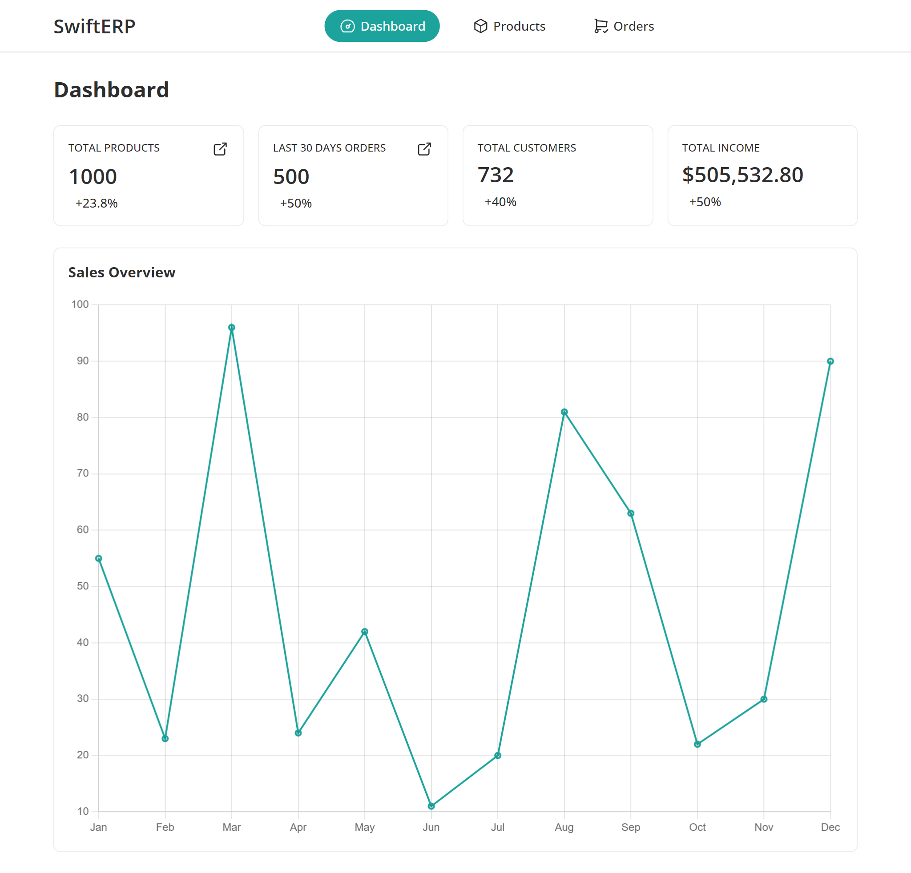
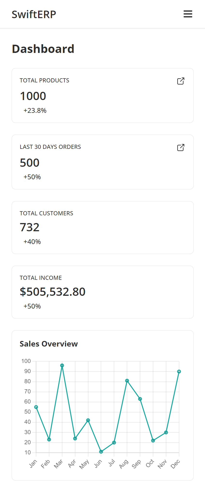
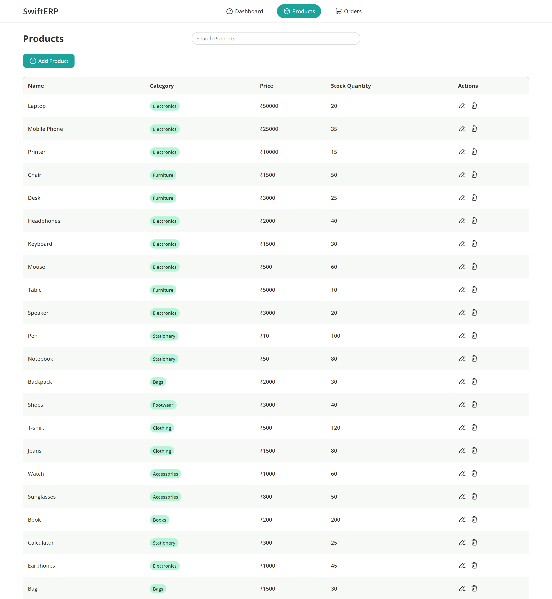
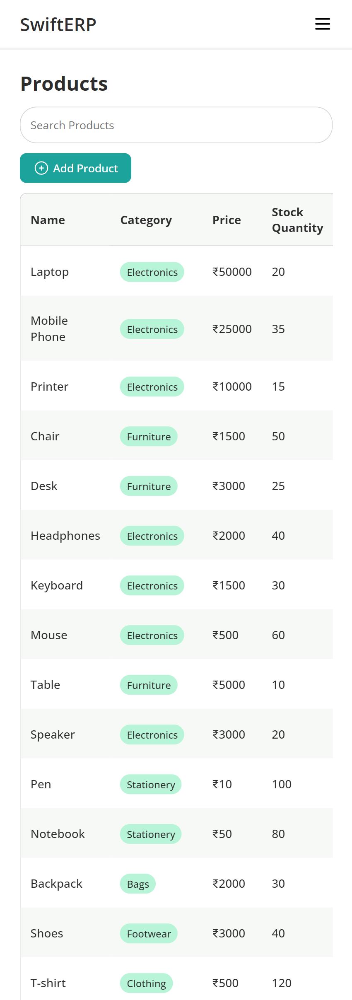
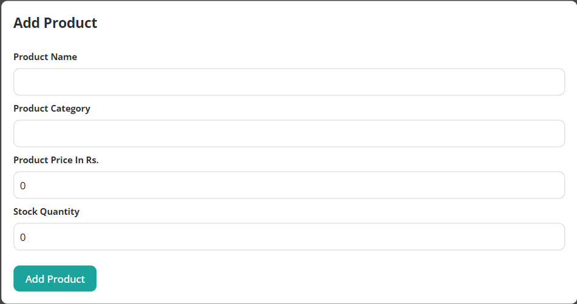
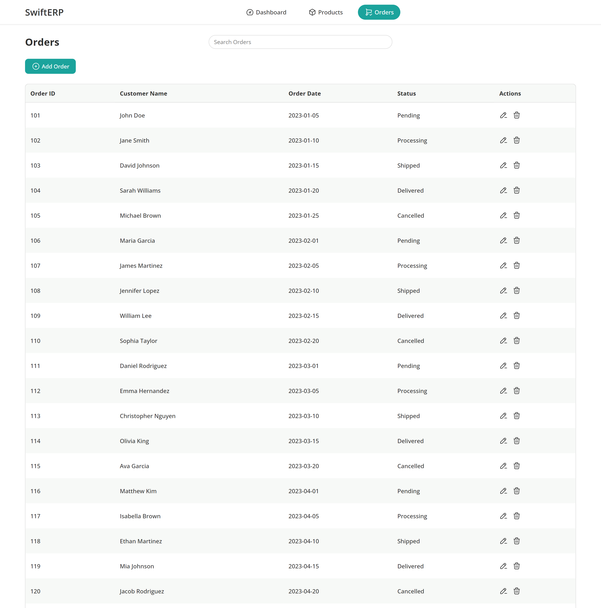

# ERP System

This is a project of ERP System made as an assignment for ENTNT interview process.

## Features

1.Dashboard

- Displays summary of key metrics or features (e.g., total number of products, orders).
- Includes links for quick navigation to the Products and Orders management pages.




2.Products Management

- Presents a list of products with details such as name, category, price, and stock quantity, using mock data.
- Functionalities to add and delete products.





3.Orders Management

- Shows a list of orders, including details like order ID, customer name, order date, and status, using mock data
- Functionalities to add and delete orders.



## Installation

1. Clone the repository to your local machine:

```sh
git clone https://github.com/karantolani/entnt-erp-assignment.git
```

2. Navigate to project directory

```sh
cd entnt-erp-assignment
```


3. Install dependencies:

```sh
npm install
```

4. Start the development server:

```sh
npm start
```

The application will be accessible at  `http://localhost:5173/`